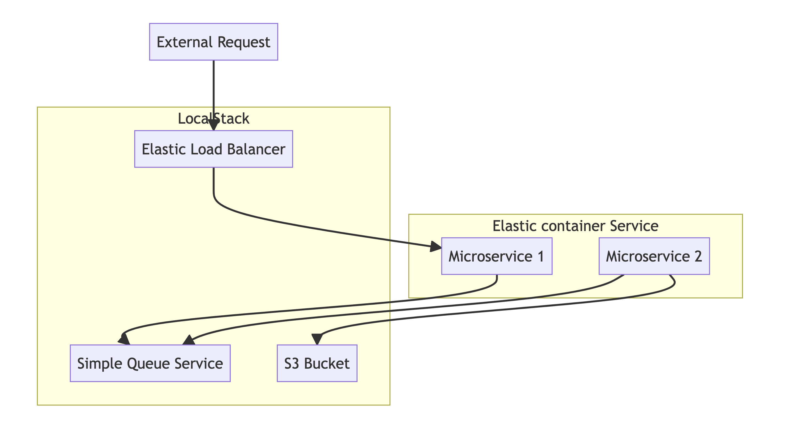
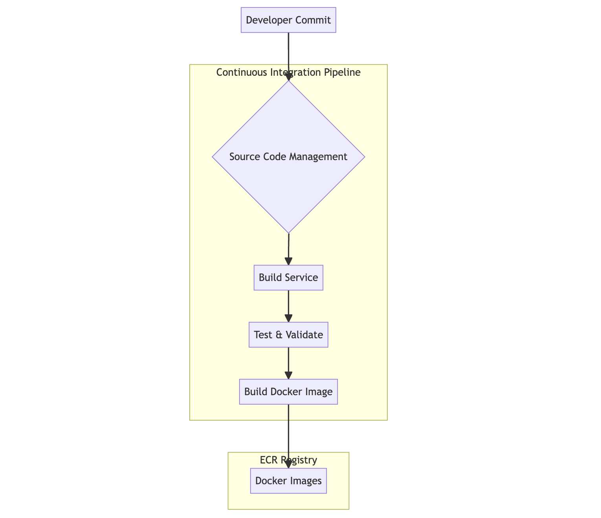
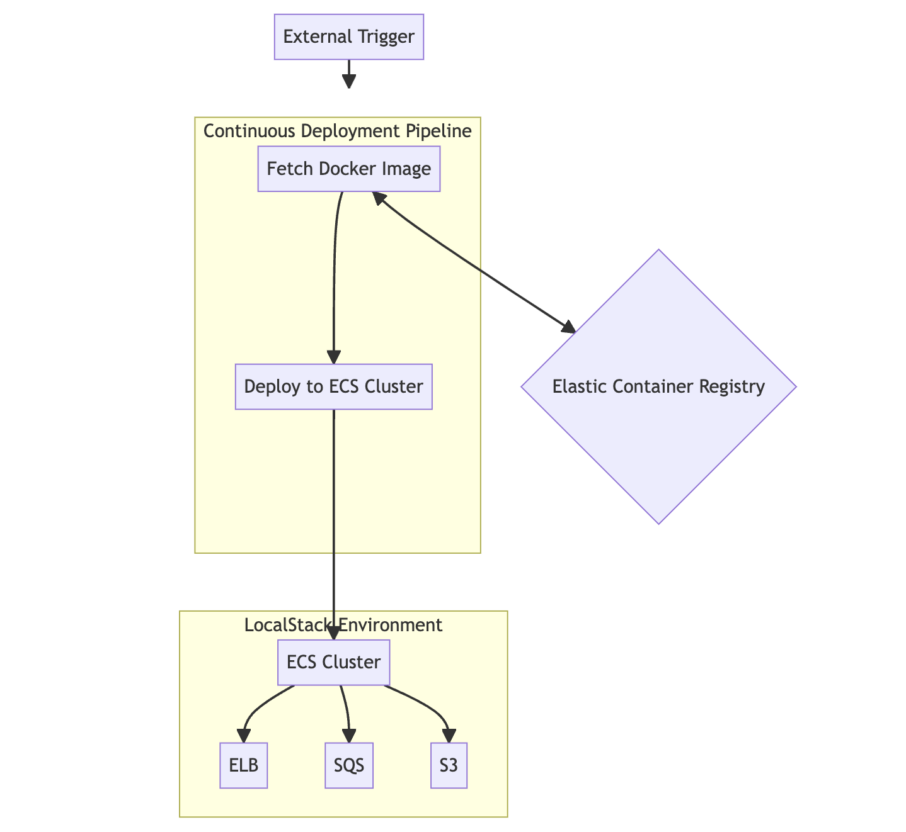

# avn-project

This project is an automated CI/CD pipeline that deploys a messaging system on LocalStack. It includes two Python microservices that interact with simulated AWS resources: ECS, S3, EC2-ELB, and SQS. The aim was to provide a simple, cloud-like development environment on a local machine.

## Table of Contents

- [Architecture](#architecture)
- [Technologies Used](#technologies-used)
- [Installation](#installation)
- [CI Process](#ci-process)
- [CD Process](#cd-process)
- [Triggering a Build](#triggering-a-build)
- [Contributing](#contributing)

---

## Architecture

This project consists of two Docker microservices built with Python and uses resources from LocalStack such as ECS, S3, ELB, and SQS. 

### Overall Architecture

### CI Process Architecture

### CD Process Architecture

---

## Technologies Used
- System
    - Python
    - Docker
- Infra 
    - Terraform
    - LocalStack AWS Services: ECS, S3, ELB, SQS
- CI/CD 
    - Jenkins

---

## Installation

Instructions to set up the local development environment.

\`\`\`bash
# Clone the repository
git clone https://github.com/mottysisam/avn-project.git

# Navigate into the directory
cd avn-project

# Add installation steps here
\`\`\`

---

## CI Process

We use Jenkins/Other CI/CD tool for the Continuous Integration process. This involves linting, testing, and building Docker images.

---

## CD Process

Continuous Deployment is automated using Jenkins/Other CI/CD tool. It is triggered by [describe the trigger, e.g., a git push, a manual trigger, etc.]

---

## Triggering a Build

triggered by build process in CI/CD pipeline / Git PR

---

